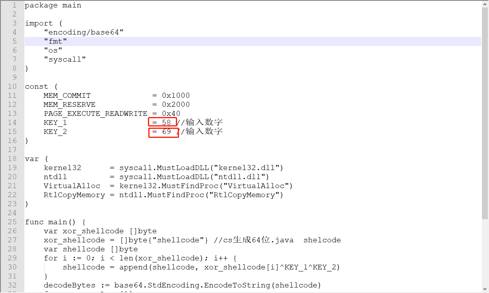
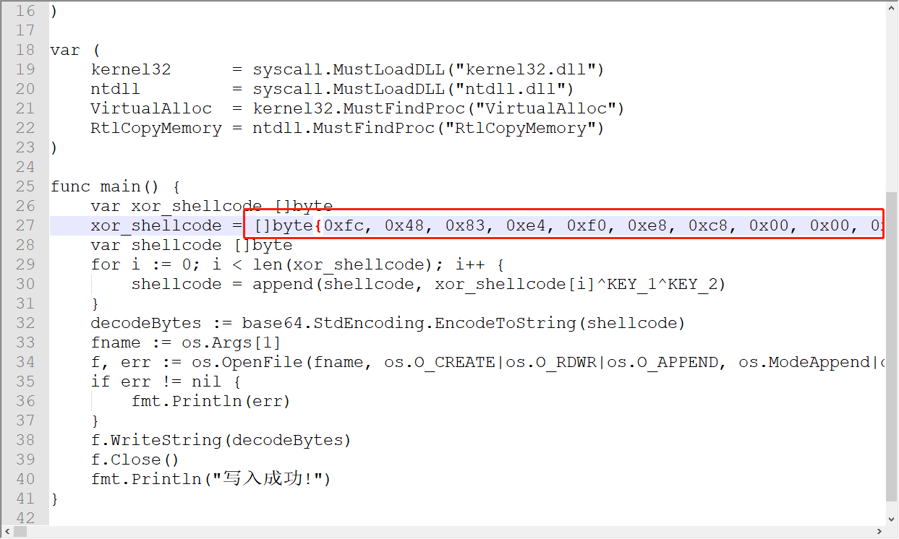
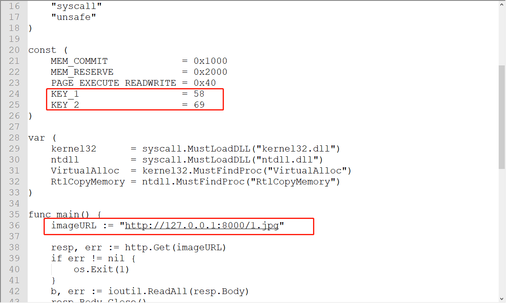
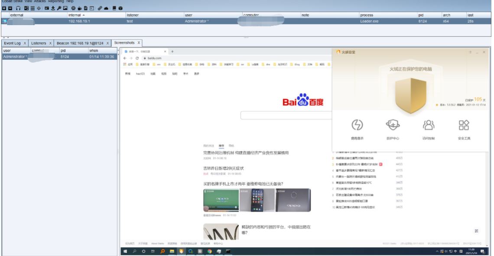

# Hou Qing-Advanced AV Evasion Tool For Red Team Ops

Hou Qing(侯卿)基于Golang语言，用于快速生成免杀的 EXE 可执行文件。

# 声明：

仅用于技术交流，请勿用于非法用途。

此项目为悬剑项目组近日基于GIthub参考研究出的一个免杀小玩意儿，目测过一些市面主流免杀，无事不必丢v站，不免杀了咱再说。

取之开源，用之开源。希望大家提出宝贵意见。

工具参考：

https://github.com/hack2fun/BypassAV

https://github.com/Gality369/CS-Loader

# 下载：

1.0下载

# 依赖：

golang 1.15.6

# 用法（细看）：

下载完成是两个文件：

code.go和loader.go

1.先打开code.go,修改如图两个key。

2.将生成的64位java Shellcode填入（去首尾多于字符，只保留代码！）替换到引号内。

如下图：

3.go run code.go + .jpg图片,如图所示：

4.将图片上传到未压缩图床。

5.修改loader.go,key值同code相同，imageURL改为图片链接即可。

6.go run loader.go即可上线。

备注：golang 调用cmd下程序隐藏黑窗口-方法
编译go时加入参数： go build -ldflags="-H windowsgui"

